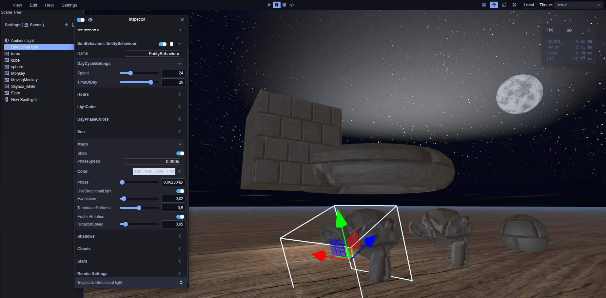
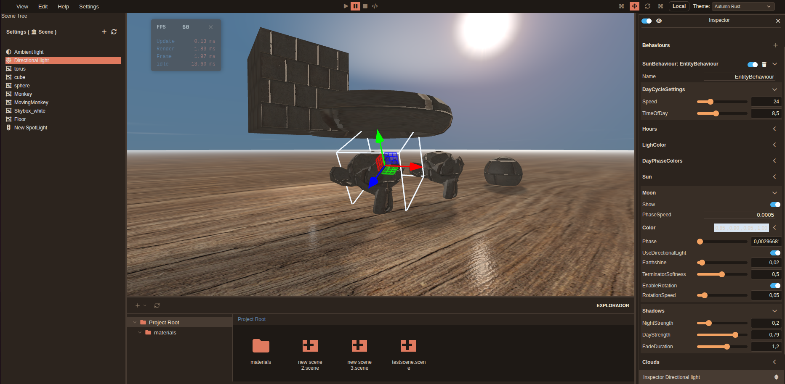

# Omega Editor

<p align="center">
  <a href="readme-assets/image.png" target="_blank">
    
  </a>
  <a href="readme-assets/image1.png" target="_blank">
    
  </a>
</p>

**Omega Editor** is a comprehensive, web-based 3D Game Engine and Editor. Built with Angular and WebGL, it provides a highly structured environment for real-time scene manipulation, entity management, and dynamic rendering. 

This project began as a dedicated space to apply and consolidate years of full-stack architectural learning, rendering math, and engine design into a unified, professional-grade toolset.

## 🌌 The Omega Ecosystem

Omega is designed with a strict separation of concerns, split across three primary pillars:

1. **Omega Editor (This Repository):** The complex Angular-driven user interface, inspector panels, and scene management tools.
2. **Omega Engine:** The core WebGL rendering and ECS logic. It is consumed by the editor as an npm package ([`omega-game-engine`](https://www.npmjs.com/package/omega-game-engine)).
3. **Omega API:** The backend service required for advanced local operations. Available at [`tugapse/omega-api`](https://github.com/tugapse/omega-api).

## ✨ Key Features

* **Entity-Component-System (ECS):** Granular control over entities through a modular behavior system (e.g., `SunBehaviour`).
* **Professional Editor Tooling:**
  * Interactive 3D transform gizmos (Translation, Rotation, Scaling).
  * Real-time performance profiling (FPS, Update, Render, and Idle ms tracking).
  * UI theming support (e.g., "Autumn Rust" and "Default").

---

## 🚀 Getting Started

> **⚠️ WIP Notice:** A unified build script is currently in development to automate this setup process prior to the official release. For now, please follow the manual steps below.

To run the Omega Editor locally, you must also have the Omega API running.

### 1. Setup the API
Clone and run the API service:
```bash
git clone [https://github.com/tugapse/omega-api.git](https://github.com/tugapse/omega-api.git)
# Follow the setup instructions in the omega-api repository